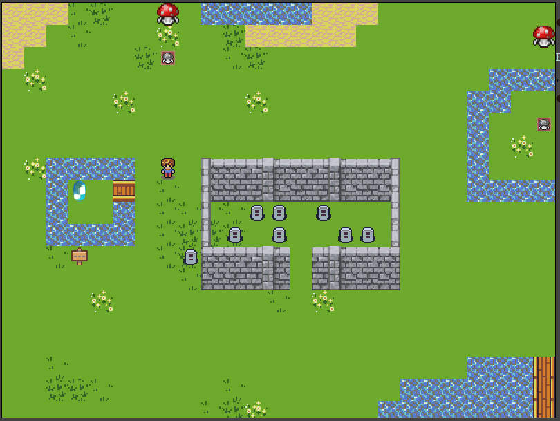

#Brandon Shaved Yesterday (the game)

# Basic Information (Non-Developers)

## Installation Instructions (How to play)

1. Install Java JDK (if you don't already have it)
  - Windows: [Download from here](http://www.oracle.com/technetwork/java/javase/downloads/jdk8-downloads-2133151.html)
  - Linux: [Follow this guide](https://www.digitalocean.com/community/tutorials/how-to-install-java-on-ubuntu-with-apt-get)
2. Download the game! (Choose one)
  - Direct Link: [HERE](https://github.com/thekakester/BrandonShavedYesterday/archive/master.zip)
  - GIT Clone link: https://github.com/thekakester/BrandonShavedYesterday.git 
3. Compile
  - Run Compile.bat (for windows) or Compile.sh (for linux)
4. Play!
  - Open a web browser and navigate to http://127.0.0.1/game.html (this is being hosted from your computer)
  - Note: If you have another program using port 80 (e.g. Skype), close it before compiling the game
  - Do you have something running on port 80? [Here's](http://stackoverflow.com/questions/48198/how-can-you-find-out-which-process-is-listening-on-a-port-on-windows) how to tell
5. Play with others!
  - The game is hosted by your computer.  Share your local or public IP with friends so they can play too!

Test server will occasionally be available at www.MitchsGa.me
Currently pending google review for adsense.
